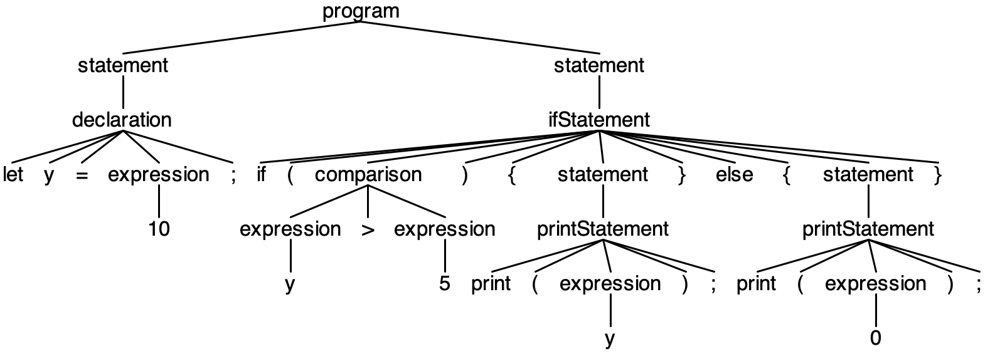
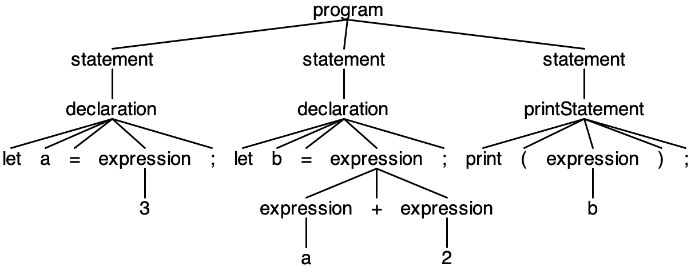

# Bericht Sprachkonzepte

## Abgabe 1

### Aufgabe

Es soll ein Text mit ANTLR4 Lexer-Regeln beschreiben und eine Anwendung erstellet werden,
die den Text einliest und als Tokenfolge ausgibt.

### Vorgehensweise

Zur Bearbeitung habe ich mich für den Text "abfahrt-kn.txt" entschieden. In diesem Text 
geht es um die Abfahrtszeiten von Bussen, Zügen sowie Schiffen mit Zielort und genauen
Datumsangaben mit Wochentagen, Monaten, Jahren sowie Ausnahmen von Tagen an denen das 
Verkehrsmittel nicht fährt.

#### 1. Lexer Regeln (AbfahrtenLexer.g4)

Die Lexer Regeln wurden in der Datei "AbfahrtenLexer.g4" definiert. Hierbei wurde der Text
in verschiedene Token unterteilt. Die Token sind:

```antlrv4
lexer grammar AbfahrtenLexer;

// Define tokens for specific words
EXCEPTION: 'nicht';
DAILY: 'täglich';
ALSO: 'auch';
UNTIL: 'bis';
TO: 'nach';

// Define tokens for special characters
MINUS: '-';
COMMA: ',';
SEMICOLON: ';';
SLASH: '/';
LPAREN: '(';
RPAREN: ')';

// Define tokens for days, months and years
WEEKDAY: 'Mo' | 'Di' | 'Mi' | 'Do' | 'Fr' | 'Sa' | 'So';
DAY: ([1-9] | [12][0-9] | '30' | '31')'.';
MONTH: 'Jan' | 'Feb' | 'Mär' | 'Apr' | 'Mai' | 'Jun' | 'Jul' | 'Aug' | 'Sep' | 'Okt' | 'Nov' | 'Dez';
YEAR: [0-9]+;

// Define tokens for time, transport types, and destinations
TIME: ([0-1][0-9] | [2][0-3]) ':' [0-5][0-9];
BUS: 'Bus ' [0-9]+;
TRAIN: 'RE ' [0-9]+;
SHIP: 'KAT';
DESTINATION: [a-zA-ZäöüÄÖÜß/()]+;


// Whitespace handling
WS: [ \t\r\n]+ -> channel(HIDDEN);
```

Durch die Ausführung des Befehls `antlr4 AbfahrtenLexer.g4` wird der Lexer generiert.

#### 2. Expression Tokenizer (ExpressionTokenizer.java)

Die Klasse `ExpressionTokenizer` wurde erstellt, um die Tokenfolge aus dem Text zu generieren.
Dazu wird die Datei "abfahrt-kn.txt" eingelesen, anschließend die generierte Klassen `AbfahrtenLexer`
aufgerufen um die Token zu generieren und die Tokenfolge ausgegeben.

```java
public class ExpressionTokenizer {
    public static void main(String[] args) throws IOException {
        String inputFile = "Abgabe1/abfahrt-kn.txt";
        String input = new String(Files.readAllBytes(Paths.get(inputFile)));

        AbfahrtenLexer lexer = new AbfahrtenLexer(CharStreams.fromString(input));
        var tokens = lexer.getAllTokens();

        for (Token t : tokens) {
            if (t.getChannel() == Token.HIDDEN_CHANNEL) {
                continue;
            }
            System.out.printf(
                    "%s(\"%s\") ",
                    lexer.getVocabulary().getSymbolicName(t.getType()),
                    t.getText());
        }
        System.out.println();
    }

    private static String replaceWhitespace(String s) {
        return s.replace("\n", "\\n").replace("\r", "\\r").replace("\t", "\\t");
    }
}
```

#### 3. Ergebnis

In der Konsole beim Ausführen des Programms wird die Tokenfolge ausgegeben.
Diese sieht wie folgt aus:

```
TIME("09:45") BUS("Bus 700") TO("nach") DESTINATION("Bahnhof") COMMA(",") DESTINATION("Ravensburg") 
WEEKDAY("Mo") MINUS("-") WEEKDAY("Mi") 
EXCEPTION("nicht") DAY("20.") MONTH("Mai") 

TIME("09:46") BUS("Bus 1") TO("nach") DESTINATION("Staad/Autofähre") COMMA(",") DESTINATION("Konstanz") 
WEEKDAY("Mo") MINUS("-") WEEKDAY("Fr") 
EXCEPTION("nicht") DAY("9.") COMMA(",") DAY("20.") COMMA(",") DAY("30.") MONTH("Mai") COMMA(",") DAY("3.") MONTH("Okt") COMMA(",") DAY("1.") MONTH("Nov") 

TIME("09:48") BUS("Bus 9") TO("nach") DESTINATION("Universität") COMMA(",") DESTINATION("Konstanz") 
EXCEPTION("nicht") DAILY("täglich") 
DAY("27.") MONTH("Mai") UNTIL("bis") DAY("18.") MONTH("Okt") YEAR("2024") WEEKDAY("Mo") MINUS("-") WEEKDAY("Mi") COMMA(",") WEEKDAY("Fr") SEMICOLON(";") EXCEPTION("nicht") DAY("3.") MONTH("Jun") UNTIL("bis") DAY("19.") MONTH("Jul") YEAR("2024") SEMICOLON(";") ALSO("auch") DAY("25.") MONTH("Jul") COMMA(",") DAY("1.") COMMA(",") DAY("8.") COMMA(",") DAY("15.") COMMA(",") DAY("22.") COMMA(",") DAY("29.") MONTH("Aug") COMMA(",") DAY("5.") COMMA(",") DAY("12.") COMMA(",") DAY("19.") COMMA(",") DAY("26.") MONTH("Sep") COMMA(",") DAY("10.") COMMA(",") DAY("17.") MONTH("Okt") 

TIME("10:00") SHIP("KAT") TO("nach") DESTINATION("Friedrichshafen") DESTINATION("Hafen") DESTINATION("(Schiff)") 
DAILY("täglich") 

TIME("10:39") TRAIN("RE 4720") TO("nach") DESTINATION("Karlsruhe") DESTINATION("Hbf") 
DAILY("täglich") 
EXCEPTION("nicht") DAY("11.") COMMA(",") DAY("12.") MONTH("Mai") COMMA(",") DAY("1.") MONTH("Jun") UNTIL("bis") DAY("12.") MONTH("Jul") YEAR("2024") COMMA(",") DAY("10.") UNTIL("bis") DAY("30.") MONTH("Aug") YEAR("2024") 
``` 

#### Probleme

1. Die Library von ANTLR4 wurde zuerst nicht richtig erkannt. Dieses Problem konnte durch importieren der Library in IntelliJ gelöst werden.
2. Wörter wie "bis", "nicht", "nach" usw. wurden als "DESTINATION" Token erkannt. Dieses Problem konnte durch explizite Angabe der Keywörter und Beachtung der Reihenfolge der Token in der Lexer-Datei gelöst werden.
3. Allgmeines Verständnis zum Unterschied von Lexer und Parser. Mein erster Versuch war direkt Regeln mit der richtigen Reihenfolge, also z.B. TIME, BUS, DESTINATION zu definieren, was allerdings bereits einem Parser gleicht und für Lexer Regeln zu komplex gedacht ist.

### Vokabular-Kategorien aus VL Folie 2-4 für den Text

In diesem Text wurden folgende Kategorien für die Token verwendet:
1. Zwischenraum (whitespace) für Leerzeichen, Tabs und Zeilenumbrüche
2. Schlüsselwörter für Wörter wie bis, nach, täglich und nicht
3. Trennzeichen für Komma, Minus (welches bis bedeutet), Semikolon usw.
4. Literale für Zeichenketter wie die Destination, Monate, Tage usw.


## Abgabe 2

### Aufgabe

Für den Teil a) der zweiten Abgabe sollte sich eine kleine Sprache ausgedacht werden, für welche ein Lexer und Parser erstellt werden soll.
Anschließend sollte für einige Beispieltexte der Parse Tree mit org.antlr.v4.gui.TestRig visualisiert werden.
Im Teil b) sollte die abstrakte Syntax aus Teil a) definiert und ein Java-Programm zur Überführung des Parse Trees in einen abstrakten Syntax Baum erstellt werden.

### Vorgehensweise

#### a) Lexer und Parser

Für den Teil a) habe ich mich für eine simple Programmiersprache entschieden, welche simple Anweisungen wie if-else, print und Rechenoperationen unterstützt.
Die Art der Syntax ist sehr JavaScript ähnlich.

Folgende Beispieltexte werden von der Sprache unterstützt:

```javascript
// Test 1.txt
let x = 5;
print(x);
```

```javascript
// Test 2.txt
let y = 10;
if (y > 5) {
  print(y);
} else {
  print(0);
}
```

```javascript
// Test 3.txt
let a = 3;
let b = a + 2;
print(b);
```

Um die Sprache in Token zu unterteilen, wurden folgende Lexer Regeln definiert:

```antlrv4
// SimpleLangLexer.g4
lexer grammar SimpleLangLexer;

// Schlüsselwörter
LET: 'let';
IF: 'if';
ELSE: 'else';
PRINT: 'print';

// Bezeichner
ID: [a-zA-Z_] [a-zA-Z_0-9]*;

// Zahlen
NUMBER: [0-9]+;

// Operatoren
PLUS: '+';
MINUS: '-';
STAR: '*';
SLASH: '/';
EQ: '==';
NEQ: '!=';
LT: '<';
GT: '>';
LE: '<=';
GE: '>=';

// Trennzeichen
SEMI: ';';
ASSIGN: '=';
LPAREN: '(';
RPAREN: ')';
LBRACE: '{';
RBRACE: '}';

// Whitespace
WS: [ \t\r\n]+ -> skip;
```

Außerdem habe ich folgende Parser Regeln definiert:

```antlrv4
// SimpleLangParser.g4
parser grammar SimpleLangParser;

options { tokenVocab = SimpleLangLexer; }

program: statement+;

statement:
    declaration
    | printStatement
    | ifStatement
    ;

declaration: LET ID ASSIGN expression SEMI;

printStatement: PRINT LPAREN expression RPAREN SEMI;

ifStatement: IF LPAREN comparison RPAREN LBRACE statement+ RBRACE (ELSE LBRACE statement+ RBRACE)?;

expression:
    ID
    | NUMBER
    | expression PLUS expression
    | expression MINUS expression
    | expression STAR expression
    | expression SLASH expression
    ;

comparison:
    expression (EQ | NEQ | LT | GT | LE | GE) expression
    ;
```

Nach Ausführen von `antlr4 SimpleLangLexer.g4` und `antlr4 SimpleLangParser.g4` konnten die erstellten Dateien mit javac *.java kompiliert werden.
Anschließend konnte mit dem Command `grun SimpleLang program -gui <Testfile>` der Parse Tree visualisiert werden.
Dies habe ich für alle 3 Testfiles durchgeführt.

Hier das Ergebnis für Test 1.txt:


Ergebnis für Test 2.txt:


Ergebnis für Test 3.txt:


#### Probleme a)

Bei der Erstellung des Parse Trees gab es Schwierigkeiten mit der Ausführung von TestRig.
Hierbei wurde der Befehl `grun` anfangs nicht erkannt. Dies lag an einem Problem beim Hinzufügen des Alias in der zsh config.
Dabei wurde der Alias nicht richtig angelegt und musste durch Öffnen der .zshrc Datei und Hinzufügen des Alias manuell gelöst werden.
Außerdem hatte ich Probleme beim Ausführen des grun Befehls, da ich es zuerst mit dem SimpleLangLexer versucht habe.
Allerdings wurde nur `SimpleLang` im command benötigt.

#### b) AST in Java

Für den Teil b) habe ich die abstrakte Syntax definiert und ein Java-Programm erstellt, welches den Parse Tree in einen abstrakten Syntax Baum überführt.
Um die abstrakte Syntax in Java zu definieren habe ich die einzelnen Klassen für die verschiedenen Anweisungen, wie z.B. expressions, if-else, usw. erstellt.

Außerdem habe ich eine Klasse `SimpleLangBuilder.java` erstellt, welche Methoden zum traversieren des Parse Trees enthält.
Dabei wird für jede Anweisung im Parse Tree eine Methode aufgerufen, welche die entsprechende abstrakte Syntax Klasse erstellt und zurückgibt.

```java
// SimpleLangBuilder.java
public class SimpleLangBuilder extends SimpleLangParserBaseListener {
    private final Stack<ASTNode> stack = new Stack<>();

    public ASTNode build(ParseTree tree) {
        new ParseTreeWalker().walk(this, tree);
        return this.stack.pop();
    }

    @Override
    public void exitDeclaration(SimpleLangParser.DeclarationContext ctx) {
        String id = ctx.ID().getText();
        ExpressionNode expr = (ExpressionNode) this.stack.pop();
        this.stack.push(new DeclarationNode(id, expr));
    }

    @Override
    public void exitPrintStatement(SimpleLangParser.PrintStatementContext ctx) {
        ExpressionNode expr = (ExpressionNode) this.stack.pop();
        this.stack.push(new PrintNode(expr));
    }

    @Override
    public void exitIfStatement(SimpleLangParser.IfStatementContext ctx) {
        List<StatementNode> elseBranch = new ArrayList<>();
        if (ctx.ELSE() != null) {
            for (SimpleLangParser.StatementContext stmtCtx : ctx.statement().subList(1, ctx.statement().size())) {
                elseBranch.addFirst((StatementNode) this.stack.pop());
            }
        }

        List<StatementNode> thenBranch = new ArrayList<>();
        for (SimpleLangParser.StatementContext stmtCtx : ctx.statement().subList(0, 1)) {
            thenBranch.addFirst((StatementNode) this.stack.pop());
        }

        ComparisonNode condition = (ComparisonNode) this.stack.pop();

        this.stack.push(new IfNode(condition, thenBranch, elseBranch));
    }

    @Override
    public void exitExpression(SimpleLangParser.ExpressionContext ctx) {
        if (ctx.children.size() == 1) {
            if (ctx.ID() != null) {
                this.stack.push(new IdentifierNode(ctx.ID().getText()));
            } else if (ctx.NUMBER() != null) {
                this.stack.push(new NumberNode(Integer.parseInt(ctx.NUMBER().getText())));
            }
        } else if (ctx.children.size() == 3) {
            ExpressionNode right = (ExpressionNode) this.stack.pop();
            ExpressionNode left = (ExpressionNode) this.stack.pop();
            String operator = ctx.getChild(1).getText();
            this.stack.push(new BinaryOperationNode(left, operator, right));
        }
    }

    @Override
    public void exitComparison(SimpleLangParser.ComparisonContext ctx) {
        ExpressionNode right = (ExpressionNode) this.stack.pop();
        ExpressionNode left = (ExpressionNode) this.stack.pop();
        String operator = ctx.getChild(1).getText();
        this.stack.push(new ComparisonNode(left, operator, right));
    }

    @Override
    public void exitProgram(SimpleLangParser.ProgramContext ctx) {
        List<StatementNode> statements = new ArrayList<>();
        int statementCount = ctx.statement().size();
        for (int i = 0; i < statementCount; i++) {
            statements.addFirst((StatementNode) this.stack.pop());
        }
        this.stack.push(new ProgramNode(statements));
    }
}
```


Die einzelnen Node Klassen des AST habe ich in der SimpleLangBuilder.java Datei erstellt.
Diese Klassen bauen sich die Expressions und Statements rekursiv auf und speichern die Werte in den entsprechenden Klassen.
Mit der toString Methode kann der AST ausgegeben werden.

```java
abstract class ASTNode {}

class ProgramNode extends ASTNode {
    List<StatementNode> statements;

    ProgramNode(List<StatementNode> statements) {
        this.statements = statements;
    }

    public String toString() {
        return statements.toString();
    }
}

abstract class StatementNode extends ASTNode {}

class DeclarationNode extends StatementNode {
    String id;
    ExpressionNode expression;

    DeclarationNode(String id, ExpressionNode expression) {
        this.id = id;
        this.expression = expression;
    }

    public String toString() {
        return id + " = " + expression;
    }
}

class PrintNode extends StatementNode {
    ExpressionNode expression;

    PrintNode(ExpressionNode expression) {
        this.expression = expression;
    }

    public String toString() {
        return String.format("print(%s)", this.expression);
    }
}

class IfNode extends StatementNode {
    ExpressionNode condition;
    List<StatementNode> thenBranch;
    List<StatementNode> elseBranch;

    IfNode(ExpressionNode condition, List<StatementNode> thenBranch, List<StatementNode> elseBranch) {
        this.condition = condition;
        this.thenBranch = thenBranch;
        this.elseBranch = elseBranch;
    }

    public String toString() {
        StringBuilder sb = new StringBuilder();
        sb.append("if (").append(this.condition).append(") {\n");
        for (StatementNode stmt : this.thenBranch) {
            sb.append("  ").append(stmt).append("\n");
        }
        sb.append("}");
        if (!this.elseBranch.isEmpty()) {
            sb.append(" else {\n");
            for (StatementNode stmt : this.elseBranch) {
                sb.append("  ").append(stmt).append("\n");
            }
            sb.append("}");
        }
        return sb.toString();
    }
}

abstract class ExpressionNode extends ASTNode {}

class IdentifierNode extends ExpressionNode {
    String name;

    IdentifierNode(String name) {
        this.name = name;
    }

    public String toString() {
        return this.name;
    }
}

class ComparisonNode extends ExpressionNode {
    private final ExpressionNode left;
    private final String operator;
    private final ExpressionNode right;

    public ComparisonNode(ExpressionNode left, String operator, ExpressionNode right) {
        this.left = left;
        this.operator = operator;
        this.right = right;
    }

    public String toString() {
        return String.format("(%s %s %s)", this.left, this.operator, this.right);
    }
}

class NumberNode extends ExpressionNode {
    int value;

    NumberNode(int value) {
        this.value = value;
    }

    public String toString() {
        return Integer.toString(this.value);
    }
}

class BinaryOperationNode extends ExpressionNode {
    ExpressionNode left;
    String operator;
    ExpressionNode right;

    BinaryOperationNode(ExpressionNode left, String operator, ExpressionNode right) {
        this.left = left;
        this.operator = operator;
        this.right = right;
    }

    public String toString() {
        return String.format("(%s %s %s)", this.left, this.operator, this.right);
    }
}
```

Um den AST zu erstellen wurde eine Java-Klasse `SimpleLangToAST.java` erstellt, welche änhlich wie in Abgabe 1 eine Textdatei einliest,
die Token generiert und den Parse Tree erstellt und diesen mithilfe von `SimpleLangBuilder` in einen AST umwandelt.

```java
// SimpleLangToAST.java
import org.antlr.v4.runtime.CharStreams;
import org.antlr.v4.runtime.CommonTokenStream;
import org.antlr.v4.runtime.tree.ParseTree;

import java.io.IOException;
import java.nio.file.Files;
import java.nio.file.Paths;

public class SimpleLangToAst {
    private SimpleLangToAst() {
    }

    public static void main(String[] args) throws IOException {
        String inputFile = "Abgabe2/Test3.txt";
        String input = new String(Files.readAllBytes(Paths.get(inputFile)));

        SimpleLangLexer lexer = new SimpleLangLexer(CharStreams.fromString(input));
        SimpleLangParser parser = new SimpleLangParser(new CommonTokenStream(lexer));
        ParseTree tree = parser.program();

        if (parser.getNumberOfSyntaxErrors() > 0) {
            System.out.printf("Found %d syntax errors.%n", parser.getNumberOfSyntaxErrors());
            System.exit(1);
        }

        ASTNode ast = new SimpleLangBuilder().build(tree);
        System.out.printf("AST: %n---%n%s%n---%n", ast.toString().substring(0, ast.toString().length() - 2) + "\n])");
    }
}
```

Folgende Ausgaben werden durch SimpleLangToAST für die Testfiles generiert:

```
// Test1.txt
AST: 
---
Program([
Declaration('x', Number(5), Print(Identifier(x))
])
---
```

```
// Test2.txt
AST: 
---
Program([
Declaration('y', Number(10), 
If(
	Comparison('Identifier(y)', '>', 'Number(5)'),
	Then(
		Print(Identifier(y))
	),
	Else(
		Print(Number(0))
	)
)
])
---
```

```
// Test3.txt
AST: 
---
Program([
Declaration('a', Number(3), 
Declaration('b', BinaryOperation('Identifier(a)', '+', 'Number(2)'), Print(Identifier(b))
])
---
```

#### Welche Terminale und Nichtterminale aus dem Ableitungsbaum werden in Ihrem AST weggelassen?

Folgende Terminale werden in meinem AST weggelassen:
1. Klammern: (, ), {, }
2. Trennzeichen: ;
3. Whitespace: Leerzeichen, Tabs und Zeilenumbrüche

Folgenden Nichtterminale werden in meinem AST weggelassen:
1. Primary-Knoten: Diese Knoten, die nur ein Kind haben, werden weggelassen, um die Struktur zu vereinfachen.
2. Expr- und MultExpr-Knoten: Wenn diese Knoten nur ein Kind haben, werden sie weggelassen.
3. Einige spezifische Nichtterminale: Wie statement, expression, comparison, die nur als Container für andere Knoten dienen und keine eigene Bedeutung im AST haben.


## Abgabe 3

### Aufgabe

Im ersten Teil der dritten Abgabe sollten zunächst folgende Fragen zu der zuvor definierten Sprache beantwortet werden:
- Lässt sich eine statische Semantik für Ihre abstrakte Syntax angeben?
- Erlaubt Ihre konkrete Syntax Formulierungen, die die statische Semantik verletzen?

Daraufhin sollte eine statische Semantikprüfung für die Sprache ergänzt werden.

Im zweiten Teil der Abgabe sollte für die eigene Sprache mindestens eine dynamische Semantik programmiert werden.

### Vorgehensweise

#### a) Statische Semantik

**Lässt sich eine statische Semantik für Ihre abstrakte Syntax angeben?**<br>
Ja, eine statische Semantik kann für die abstrakte Syntax angegeben werden:
- Variablendeklarationen: Eine Variable muss deklariert werden, bevor sie in einer Expression verwendet wird.<br>
- Mehrfachdeklaration: Eine Variable darf nicht mehrmals im selben Gültigkeitsbereich deklariert werden.<br>

**Erlaubt Ihre konkrete Syntax Formulierungen, die die statische Semantik verletzen?**<br>
Ja, die konkrete Syntax erlaubt Formulierungen, die die statische Semantik verletzen könnten:
- Verwendung nicht deklarierter Variablen: Die Grammatik erlaubt es, dass eine Variable in einem Ausdruck verwendet wird, ohne dass sie vorher deklariert wurde.<br>
- Mehrfachdeklaration: Die Grammatik erlaubt es, dass eine Variable mehrmals im selben Gültigkeitsbereich deklariert wird.<br>

#### Statische Semantikprüfung
Um die statische Semantikprüfung zu implementieren, habe ich meine Klasse `SimpleLangBuilder` erweitert.
Zuerst habe ich eine Map `symbolTable` erstellt, um die Variablendeklarationen zu speichern.
Außerdem wurde eine Methode zur Ausgabe eines Semantikfehlers hinzugefügt. Diese Methode wird aufgerufen, wenn ein Fehler
in der statischen Semantik gefunden wird und gibt die Zeile und Position des Fehlers sowie die Ursache aus.

Anschließend habe ich die Methoden `exitDeclaration` sowie `exitExpression` erweitert, um die Variablendeklarationen zu überprüfen.
Bei 'exitDeclaration' wird überprüft, ob die Variable bereits deklariert wurde, um sicherzustellen, dass keine Variable doppelt
deklariert wird. Bei 'exitExpression' wird überprüft, ob die Variable vorher deklariert wurde, damit sie ohne Deklaration
aufgerufen werden kann.

```java
private Map<String, String> symbolTable = new HashMap<>();

private void semanticErr(Token token, String message) {
    System.err.printf("Line %d:%d - %s%n", token.getLine(), token.getCharPositionInLine(), message);
}

@Override
public void exitDeclaration(SimpleLangParser.DeclarationContext ctx) {
    String id = ctx.ID().getText();

    // Check if the identifier is already declared
    if (this.symbolTable.containsKey(id)) {
        this.semanticErr(ctx.ID().getSymbol(), String.format("Identifier '%s' is already declared.", id));
    } else {
        this.symbolTable.put(id, "int");
    }

    ExpressionNode expr = (ExpressionNode) this.stack.pop();
    this.stack.push(new DeclarationNode(id, expr));
}

@Override
public void exitExpression(SimpleLangParser.ExpressionContext ctx) {
    if (ctx.children.size() == 1) {
        if (ctx.ID() != null) {
            // Check if the identifier is declared
            String id = ctx.ID().getText();
            if (!this.symbolTable.containsKey(id)) {
                this.semanticErr(ctx.ID().getSymbol(), String.format("Identifier '%s' is not declared.", id));
            }

            this.stack.push(new IdentifierNode(ctx.ID().getText()));
        } else if (ctx.NUMBER() != null) {
            this.stack.push(new NumberNode(Integer.parseInt(ctx.NUMBER().getText())));
        }
    } else if (ctx.children.size() == 3) {
        ExpressionNode right = (ExpressionNode) this.stack.pop();
        ExpressionNode left = (ExpressionNode) this.stack.pop();
        String operator = ctx.getChild(1).getText();
        this.stack.push(new BinaryOperationNode(left, operator, right));
    }
}
```

Um zu Testen, ob die statische Semantikprüfung funktioniert, habe ich folgenden Testfall erstellt:

```javascript
// Test 4.txt
let a = 3;
let b = a + 2;
print(b);

let a = 4;
print(c);
```

Die Ausgabe für Test 4.txt sieht wie folgt aus:

```
Line 5:4 - Identifier 'a' is already declared.
Line 6:6 - Identifier 'c' is not declared.

AST: 
---
Program([
Declaration('a', Number(3), 
Declaration('b', BinaryOperation('Identifier(a)', '+', 'Number(2)'), Print(Identifier(b)), 
Declaration('a', Number(4), Print(Identifier(c))
])
---
```

#### Probleme